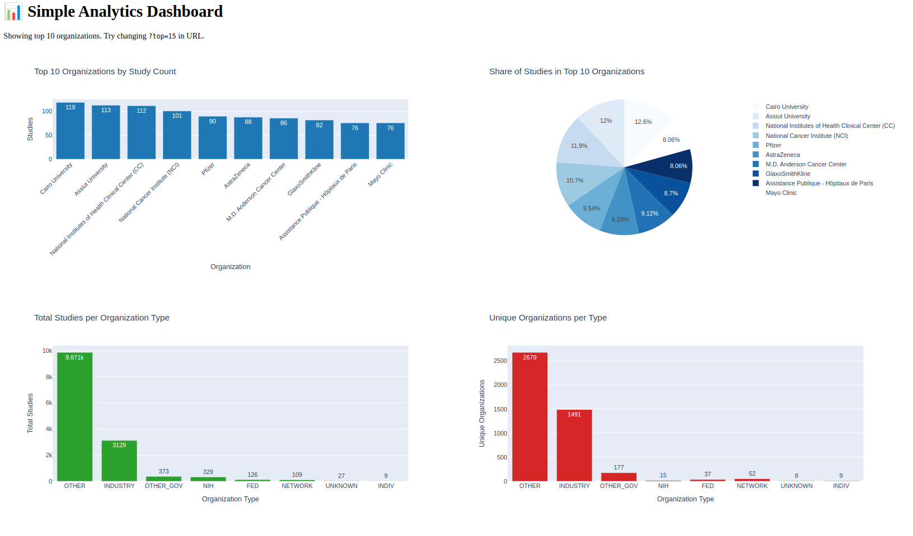

# Data Analysis and Research Platform

A comprehensive platform for managing research studies, collecting data, and performing analysis. The platform consists of three main microservices and uses PostgreSQL databases for data storage.

## Architecture Overview

The system consists of three main services:
 
1. **Scraper Service**: Collects study data from https://clinicaltrials.gov/data-api/api
2. **Analysis Service**: Collects data from the Scraper Service and performs data analysis dashboards 
3. **API Service**: Main REST API for handling study data Scraper Service and Analysis Service


## Database Structure

The platform uses two PostgreSQL databases:

- **Main Database**: Stores study information
- **Analysis Database**: Stores processed data from Main Database

## Prerequisites

- Docker and Docker Compose
- Python 3.12+
- Make

## Setup and Installation

### Local Development Setup

1. Clone the repository:
   ```bash
   git clone https://github.com/AntonAks/TaskFromTal.git
   cd TaskFromTal
   ```

2. Set up the environment:
   ```bash
   make setup-local-env
   ```
   This will install requirements and set up pre-commit hooks.
3. Activate the virtual environment:
   ```bash
   source .venv/bin/activate
   ```
4. Configure environment variables:
   - By default `.env.local` will be used during build and run of application

### Starting the Platform

To start all services in development mode:

```bash
make start
```
This will build and start all Docker containers defined in `docker-compose.yaml` using `.env.local`
To restart the platform (rebuild and restart all containers):
```bash
make restart
```

### Production Deployment
To start the platform in production mode:

```bash
make start-prod
```
This uses the `docker-compose-prod.yaml` configuration with production settings from `.env.prod`.

## API Documentation

Once the API service is running, you can access the API documentation at:
http://localhost:8888/docs

This provides an interactive Swagger UI to explore and test the API endpoints.

## API Analysis dashboards

Once the all services are running, you can access the Analysis dashboards:
http://localhost:8887

## Analysis dashboard example
**After the first start you need to wait for 60 seconds before data on Analysis service will be processed**



## Testing

The project includes a comprehensive test suite. To run the tests:

```bash
pytest -vv
```

This will run all tests with SQLite as a test database.

## Development Workflow

This project uses pre-commit hooks to ensure code quality:

- Black for code formatting
- Flake8 for linting
- MyPy for type checking
- Pytest for automated testing

To manually run the pre-commit checks:

```bash
make run-pre-commit
```

## Project Structure

```
├── analysis_service/    # Analysis service for data processing
│   ├── Dockerfile
│   ├── charts.py        # Charts and visualization logic
│   ├── db/              # Database models and connections
│   ├── main.py          # Service entry point
│   ├── settings.py      # Service configuration
│   └── tasks.py         # Analysis tasks
├── api/                 # Main API service
│   ├── Dockerfile
│   ├── db/              # Database models and connections
│   ├── dtos/            # Data Transfer Objects
│   │   ├── analysis.py  # Analysis DTOs
│   │   └── study.py     # Study DTOs
│   ├── main.py          # API entry point
│   ├── routers/         # API route handlers
│   │   ├── analysis.py  # Analysis endpoints
│   │   └── study.py     # Study endpoints
│   └── settings.py      # API configuration
├── db/                  # Database configuration
│   ├── config/          # Database environment variables
│   ├── db-analysis-init/ # Analysis DB initialization scripts
│   └── db-main-init/    # Main DB initialization scripts
├── scraper/             # Scraper service
│   ├── Dockerfile
│   ├── data_parser.py   # Data parsing logic
│   ├── db/              # Database models and connections
│   ├── main.py          # Service entry point
│   ├── settings.py      # Service configuration
│   └── tasks.py         # Scraping tasks
├── tests/               # Test suite
│   ├── conftest.py      # Test fixtures and configuration
│   └── test_api.py      # API tests
├── docker-compose.yaml        # Development environment configuration
├── docker-compose-prod.yaml   # Production environment configuration
├── Makefile                   # Project management commands
├── pytest.ini                 # Pytest configuration
└── requirements.txt           # Global dependencies
```
